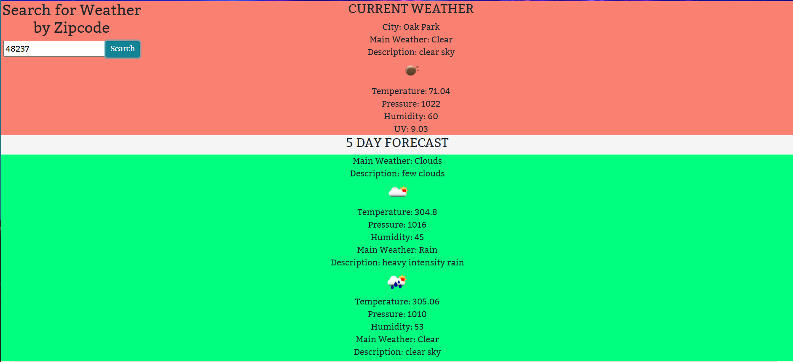

# Weather-Dashboard
A weather dashboard that will run in the browser and feature dynamically updated HTML and CSS.
It will retrieve real time weather data for current day and 5 day forecast. 

Here is a link: https://arob7.github.io/Weather-Dashboard/

A screenshot: 

